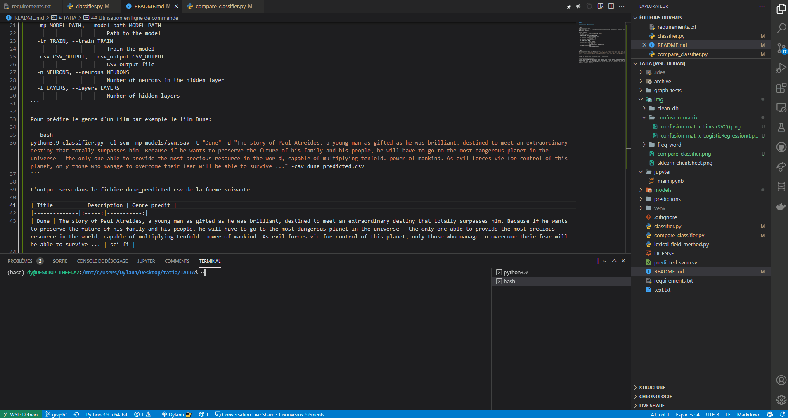

# TATIA

Prediction de genre de film grâce à son synopsis.

## Utilisation en ligne de commande

Pour obtenir de l’aide :

```bash
$ python3 classifier.py -h
usage: classifier.py [-h] [-t TITLE] [-d DESCRIPTION] [-cl CLASSIFIER] [-mp MODEL_PATH] [-tr TRAIN] [-csv CSV_OUTPUT] [-n NEURONS] [-l LAYERS] [-trs TRAIN_SIZE] [-tes TEST_SIZE]

Predict genre of a movie

optional arguments:
  -h, --help            show this help message and exit
  -t TITLE, --title TITLE
                        Title of the movie
  -d DESCRIPTION, --description DESCRIPTION
                        Description of the movie
  -cl CLASSIFIER, --classifier CLASSIFIER
                        Classifier to use
  -mp MODEL_PATH, --model_path MODEL_PATH
                        Path to the model
  -tr TRAIN, --train TRAIN
                        Train the model
  -csv CSV_OUTPUT, --csv_output CSV_OUTPUT
                        CSV output file
  -n NEURONS, --neurons NEURONS
                        Number of neurons in the hidden layer
  -l LAYERS, --layers LAYERS
                        Number of hidden layers
  -trs TRAIN_SIZE, --train_size TRAIN_SIZE
                        Train size
  -tes TEST_SIZE, --test_size TEST_SIZE
                        Test size
```

## Prediction

Pour prédire le genre d'un film par exemple le film Dune :

```bash
python3 classifier.py -cl svm -mp models/svm.sav -t "Dune" -d "The story of Paul Atreides, a young man as gifted as he was brilliant, destined to meet an extraordinary destiny that totally surpasses him. Because if he wants to preserve the future of his family and his people, he will have to go to the most dangerous planet in the universe - the only one able to provide the most precious resource in the world, capable of multiplying tenfold. power of mankind. As evil forces vie for control of this planet, only those who manage to overcome their fear will be able to survive ..." -csv dune_predicted.csv
```
La prédiction sera faite sur le modèle SVM et l'output sera dans le fichier dune_predicted.csv de la forme suivante :

| Title         | Description | Genre_predit |
|--------------|:-----:|-----------:|
| Dune | The story of Paul Atreides, ... , only those who manage to overcome their fear will be able to survive ... | sci-fi |



## Apprentissage

MLPClassifier
```bash
python3 classifier.py --train true -mp "neural_network.sav" -cl neural_network -n 46 -l 1
```
Entrainement du modèle via le réseau de neurones sur la base de données d'entrainement avec 1 layer et 46 neurones et l'enregistre dans `neural_network.sav`.

SVM
```bash
python3 classifier.py --train true -mp "svm.sav" -cl svm -trs 0.5 -tes 0.1
```
Entrainement du modèle via SVM sur la base de données d'entrainement avec test_size=0.1 et train_size=0.5 et l'enregistre dans `svm.sav`.

LogisticRegression
```bash
python3 classifier.py --train true -mp "logistic_regression_model.sav" -cl logistic_regression -tes 0.2 -trs 0.7
```
Entrainement du modèle via LogisticRegression sur la base de données d'entrainement avec test_size=0.2 et train_size=0.7 et l'enregistre dans `logistic_regression.sav`.
